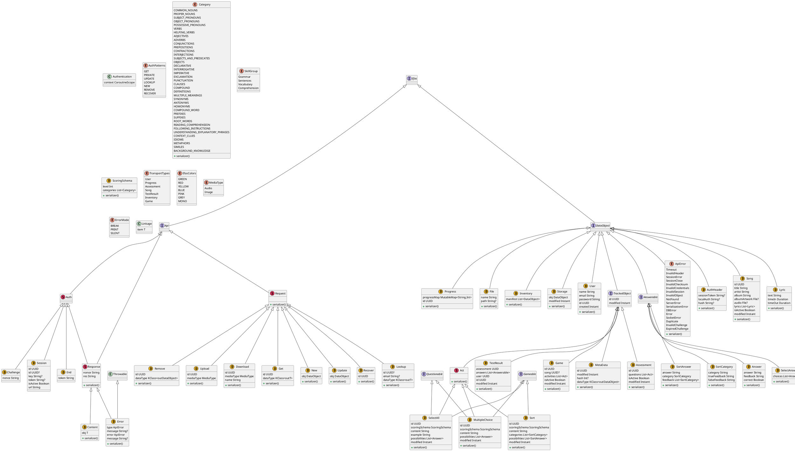

```plantuml
@startuml
class "Authentication" {
	context CoroutineScope
}
class "AuthHeader" <<(D, #DFAB25)>> {
	sessionToken String? 
	localAuth String? 
	hash String? 
__
	+ serializer()
}
enum "AuthPatterns" {
	GET
	PRIVATE
	UPDATE
	LOOKUP
	NEW
	REMOVE
	RECOVER
}
class "Auth" <<(S, #D9335B)>> {
	
}
class "Challenge" <<(D, #DFAB25)>> {
	nonce String
}
class "Response" <<(D, #DFAB25)>> {
	nonce String
	res String
}
class "Session" <<(D, #DFAB25)>> {
	id UUID
}
class "End" <<(D, #DFAB25)>> {
	token String
}
class "Session" {
	id UUID? 
	key String? 
	token String? 
	isActive Boolean
	url String
}
abstract "MpUUID" {
	
__
	+ serializer()
}
class "UUID" {
	mostSignificantBits Long
	leastSignificantBits Long
__
	+ serializer()
}
enum "Category" {
	COMMON_NOUNS
	PROPER_NOUNS
	SUBJECT_PRONOUNS
	OBJECT_PRONOUNS
	POSSESSIVE_PRONOUNS
	VERBS
	HELPING_VERBS
	ADJECTIVES
	ADVERBS
	CONJUNCTIONS
	PREPOSITIONS
	CONTRACTIONS
	INTERJECTIONS
	SUBJECTS_AND_PREDICATES
	OBJECTS
	DECLARATIVE
	INTERROGATIVE
	IMPERATIVE
	EXCLAMATION
	PUNCTUATION
	CLAUSES
	COMPOUND
	DEFINITIONS
	MULTIPLE_MEANINGS
	SYNONYMS
	ANTONYMS
	HOMONYMS
	COMPOUND_WORD
	PREFIXES
	SUFFIXES
	ROOT_WORDS
	READING_COMPREHENSION
	FOLLOWING_INSTRUCTIONS
	UNDERSTANDING_EXPLANATORY_PHRASES
	CONTEXT_CLUES
	IDIOMS
	METAPHORS
	SIMILES
	BACKGROUND_KNOWLEDGE
__
	+ serializer()
}
enum "SkillGroup" {
	Grammar
	Sentences
	Vocabulary
	Comprehension
}
class "Song" <<(D, #DFAB25)>> {
	id UUID
	title String
	artist String
	album String
	albumArtwork File? 
	audio File? 
	lyrics List<Lyric>
	isActive Boolean
	modified Instant
__
	+ serializer()
}
class "Lyric" <<(D, #DFAB25)>> {
	text String
	timeIn Duration
	timeOut Duration
__
	+ serializer()
}
class "Progress" <<(D, #DFAB25)>> {
	progressMap MutableMap<String,Int>
	id UUID
__
	+ serializer()
}
class "MetaData" <<(D, #DFAB25)>> {
	id UUID
	modified Instant
	hash Int? 
	dataType KClass<outDataObject>
__
	+ serializer()
}
class "File" <<(D, #DFAB25)>> {
	name String
	path String? 
__
	+ serializer()
}
class "Inventory" <<(D, #DFAB25)>> {
	manifest List<DataObject>
__
	+ serializer()
}
class "Storage" <<(D, #DFAB25)>> {
	obj DataObject
	modified Instant
__
	+ serializer()
}
class "Assessment" <<(D, #DFAB25)>> {
	id UUID
	questions List<Act>
	isActive Boolean
	modified Instant
__
	+ serializer()
}
class "ScoringSchema" <<(D, #DFAB25)>> {
	level Int
	categories List<Category>
__
	+ serializer()
}
class "User" <<(D, #DFAB25)>> {
	name String
	email String
	password String
	id UUID
	created Instant
__
	+ serializer()
}
class "TestResult" <<(D, #DFAB25)>> {
	assessment UUID
	answers List<Answerable>
	user UUID
	id UUID
	modified Instant
__
	+ serializer()
}
class "Act" <<(S, #D9335B)>> {
	
__
	+ serializer()
}
class "MultipleChoice" <<(D, #DFAB25)>> {
	id UUID
	scoringSchema ScoringSchema
	content String
	possibilities List<Answer>
	modified Instant
__
	+ serializer()
}
class "SelectAll" <<(D, #DFAB25)>> {
	id UUID
	scoringSchema ScoringSchema
	content String
	example String
	possibilities List<Answer>
	modified Instant
__
	+ serializer()
}
class "Sort" <<(D, #DFAB25)>> {
	id UUID
	scoringSchema ScoringSchema
	content String
	categories List<SortCategory>
	possibilities List<SortAnswer>
	modified Instant
__
	+ serializer()
}
class "Answer" <<(D, #DFAB25)>> {
	answer String
	feedback String
	correct Boolean
__
	+ serializer()
}
class "SelectAnswer" <<(D, #DFAB25)>> {
	choices List<Answer>
__
	+ serializer()
}
class "SortAnswer" <<(D, #DFAB25)>> {
	answer String
	category SortCategory
	feedback List<SortCategory>
__
	+ serializer()
}
class "SortCategory" <<(D, #DFAB25)>> {
	category String
	trueFeedback String
	falseFeedback String
__
	+ serializer()
}
class "Game" <<(D, #DFAB25)>> {
	id UUID
	song UUID?
	activities List<Act>
	isActive Boolean
	modified Instant
__
	+ serializer()
}
interface "Efas" {
	
}
interface "Api" {
	
}
interface "DataObject" {
	
}
interface "TrackedObject" {
	id UUID
	modified Instant
}
interface "Questionable" {
	
}
interface "Gameable" {
	
}
interface "Answerable" {
	
}
interface "Time" {
	millis Long
}
class "Duration" {
	millis Long
__
	+ serializer()
}
class "Instant" {
	millis Long
__
	+ serializer()
}
enum "TransportTypes" {
	User
	Progress
	Assessment
	Song
	TestResult
	Inventory
	Game
}
enum "EfasColors" {
	GREEN
	RED
	YELLOW
	BLUE
	PINK
	GREY
	MONO
}
class "Error" {
	type ApiError
	message String? 
}
enum "ApiError" {
	Timeout
	InvalidHeader
	SessionError
	SessionClose
	InvalidChecksum
	InvalidCredentials
	InvalidSession
	InvalidObject
	NotFound
	ServerError
	SerializationError
	DBError
	Error
	SocketError
	Duplicate
	InvalidChallenge
	ExpiredChallenge
__
	+ serializer()
}
class "Response" <<(S, #D9335B)>> {
	
__
	+ serializer()
}
class "Content" <<(D, #DFAB25)>> {
	obj T
__
	+ serializer()
}
class "Error" <<(D, #DFAB25)>> {
	error ApiError
	message String? 
__
	+ serializer()
}
class "Request" <<(S, #D9335B)>> {
	
__
	+ serializer()
}
class "Get" <<(D, #DFAB25)>> {
	id UUID
	dataType KClass<outT>
__
	+ serializer()
}
class "New" <<(D, #DFAB25)>> {
	obj DataObject
__
	+ serializer()
}
class "Update" <<(D, #DFAB25)>> {
	obj DataObject
__
	+ serializer()
}
class "Recover" <<(D, #DFAB25)>> {
	id UUID
__
	+ serializer()
}
class "Lookup" <<(D, #DFAB25)>> {
	id UUID? 
	email String? 
	dataType KClass<outT>
__
	+ serializer()
}
class "Remove" <<(D, #DFAB25)>> {
	id UUID
	dataType KClass<outDataObject>
__
	+ serializer()
}
class "Upload" <<(D, #DFAB25)>> {
	id UUID
	mediaType MediaType
__
	+ serializer()
}
class "Download" <<(D, #DFAB25)>> {
	id UUID
	mediaType MediaType
	name String
__
	+ serializer()
}
enum "MediaType" {
	Audio
	Image
}
enum "ErrorMode" {
	BREAK
	PRINT
	SILENT
}
class "Linkage" {
	item T
}
"DataObject" <|--- AuthHeader
"Api" <|--- Auth
"Auth" <|--- Challenge
"Auth" <|--- Response
"Auth" <|--- Session
"Auth" <|--- End
"Comparable<UUID" <|--- MpUUID
"MpUUID" <|--- UUID
"DataObject" <|--- Song
"DataObject" <|--- Lyric
"DataObject" <|--- Progress
"TrackedObject" <|--- MetaData
"DataObject" <|--- File
"DataObject" <|--- Inventory
"DataObject" <|--- Storage
"TrackedObject" <|--- Assessment
"DataObject" <|--- User
"TrackedObject" <|--- TestResult
"TrackedObject" <|--- Act
"Act" <|--- MultipleChoice
"Questionable" <|--- MultipleChoice
"Gameable" <|--- MultipleChoice
"Act" <|--- SelectAll
"Questionable" <|--- SelectAll
"Gameable" <|--- SelectAll
"Act" <|--- Sort
"Gameable" <|--- Sort
"Answerable" <|--- Answer
"Answerable" <|--- SelectAnswer
"Answerable" <|--- SortAnswer
"Answerable" <|--- SortCategory
"TrackedObject" <|--- Game
"Efas" <|--- Api
"Efas" <|--- DataObject
"DataObject" <|--- TrackedObject
"DataObject" <|--- Answerable
"Time" <|--- Duration
"Comparable<Duration" <|--- Duration
"Time" <|--- Instant
"Comparable<Instant" <|--- Instant
"Throwable" <|--- Error
"DataObject" <|--- ApiError
"Api" <|--- Response
"Response" <|--- Content
"Response" <|--- Error
"Api" <|--- Request
"Request" <|--- Get
"Request" <|--- New
"Request" <|--- Update
"Request" <|--- Recover
"Request" <|--- Lookup
"Request" <|--- Remove
"Request" <|--- Upload
"Request" <|--- Download
@enduml
```