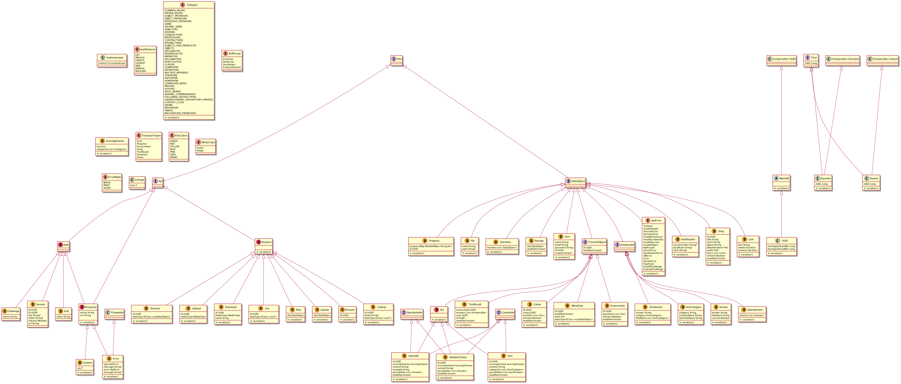

# MetaView

 A code visulization tool based on plantUML and ANTLR

TODO
- [ ] Delegation ignore
- [ ] split type arguments consistently
- [ ] functional hierarchies
- [ ] convert to gradle plugin
- [ ] style input

###Sample generated diagram:

